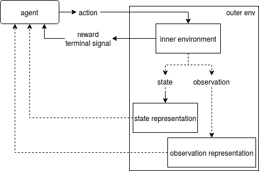

==========================
Design of the environments
==========================

.. outer env

An 'environment' in `Gridverse` is best represented by the
:py:class:`~gym_gridverse.outer_env.OuterEnv` class, which is a wrapper of:

- an :py:class:`~gym_gridverse.envs.inner_env.InnerEnv`
- an optional :py:class:`~gym_gridverse.representations.representation.StateRepresentation`, and
- an optional :py:class:`~gym_gridverse.representations.representation.ObservationRepresentation`

It's interface is simple on purpose, and provides a
:py:meth:`~gym_gridverse.outer_env.OuterEnv.step` function and getters for the
:py:func:`~gym_gridverse.outer_env.OuterEnv.action_space`, current
:py:func:`~gym_gridverse.outer_env.OuterEnv.state`, and
:py:meth:`~gym_gridverse.outer_env.OuterEnv.observation`.

.. design philosophy

The idea is that the representation of `states` and `observations`, how the
agent *perceives* the environment, should be independent of its dynamics. The
intention is that the agent selects :py:class:`~gym_gridverse.action.Action`,
the inner environment updates the :py:class:`~gym_gridverse.state.State` and
:py:class:`~gym_gridverse.observation.Observation`, and (optionally) the
representation takes care of converting those objects into arrays:

The rest of this document describes each of these classes in more detail.

Actions, State, Observations, Rewards, and Terminal signals
===========================================================

These elements are the data containers upon which all the other components act.

Actions
-------

.. autoclass:: gym_gridverse.action.Action
  :noindex:

State
-----

.. autoclass:: gym_gridverse.state.State
  :noindex:

Observation
-----------

.. autoclass:: gym_gridverse.observation.Observation
  :noindex:

Terminal signal
---------------

Particular (actions can lead to) states (that) are terminal. This means that
the interaction in the environment has ended. In Gridverse this is encoded with
a :py:class:`bool`.

Reward signal
-------------

Every state transition is associated with a ``reward`` (:py:class:`float`).
This reward is a numerical evaluation of the transition, generally the agent
attempts to maximize over the reward it receives over time.

Inner Environment
=================

The inner environment handles the dynamics of the system: how to

- (re)set initial :py:func:`~gym_gridverse.state.State`
- update :py:func:`~gym_gridverse.state.State` (and generate the
  initial one)
- generate :py:meth:`~gym_gridverse.observation.Observation`
- generate ``rewards`` and ``terminal signals``

These responsibilities are split into one functions and two properties:
:py:meth:`~gym_gridverse.envs.inner_env.InnerEnv.reset`,
:py:meth:`~gym_gridverse.envs.inner_env.InnerEnv.step`,
:py:meth:`~gym_gridverse.envs.inner_env.InnerEnv.observation` and
:py:meth:`~gym_gridverse.envs.inner_env.InnerEnv.state`:

.. automethod:: gym_gridverse.envs.inner_env.InnerEnv.reset
  :noindex:

.. automethod:: gym_gridverse.envs.inner_env.InnerEnv.step
  :noindex:

.. autoattribute:: gym_gridverse.envs.inner_env.InnerEnv.observation
  :noindex:

.. autoattribute:: gym_gridverse.envs.inner_env.InnerEnv.state
  :noindex:

Under the hood, the step function work through the following functions:

- :py:class:`~gym_gridverse.envs.transition_functions.TransitionFunction`
- :py:class:`~gym_gridverse.envs.observation_functions.ObservationFunction`
- :py:class:`~gym_gridverse.envs.reward_functions.RewardFunction`
- :py:data:`~gym_gridverse.envs.terminating_functions.TerminatingFunction`

.. note::

  :py:class:`~gym_gridverse.envs.inner_env.InnerEnv` is an interface, but there
  is only one implementation
  (:py:class:`~gym_gridverse.envs.gridworld.GridWorld`). Technically other
  environments can be implemented, for which the rest of this section would not
  necessarily hold. Our argument for doing this way is to separate the
  responsibility of *maintaining state* (in
  :py:class:`~gym_gridverse.envs.inner_env.InnerEnv`) from the *functional
  dynamics* (in :py:class:`~gym_gridverse.envs.gridworld.GridWorld`).

Their relationship (excluding the reset function) is best described by the
following figure. The section starting on the next page describes how to use or
create your own.

.. image:: ../figures/inner-env-design.png

Representations
===============

The :py:class:`~gym_gridverse.state.State` and
:py:class:`~gym_gridverse.observation.Observation` are python objects, their
respective representations convert them into arrays.

A representation takes in the python object, and returns a dictionary of
:py:class:`str` to :py:class:`numpy.ndarray` mappings. Typical elements in this
array are the ``grid``, ``agent_id_grid``, ``agent``, ``item`` representations.

State Representations
---------------------

The abstract interface for state representations is
:py:class:`~gym_gridverse.representations.representation.StateRepresentation`.
Anything that implements the ``convert`` signature below suffices:

.. automethod:: gym_gridverse.representations.representation.StateRepresentation.convert
  :noindex:

Available representations can be found in
:py:mod:`~gym_gridverse.representations.state_representations`.

Observation Representations
---------------------------

The abstract interface for observation representations is
:py:class:`~gym_gridverse.representations.representation.ObservationRepresentation`.
Anything that implements the ``convert`` signature below suffices:

.. automethod:: gym_gridverse.representations.representation.ObservationRepresentation.convert
  :noindex:

Available representations can be found in
:py:mod:`~gym_gridverse.representations.observation_representations`.

